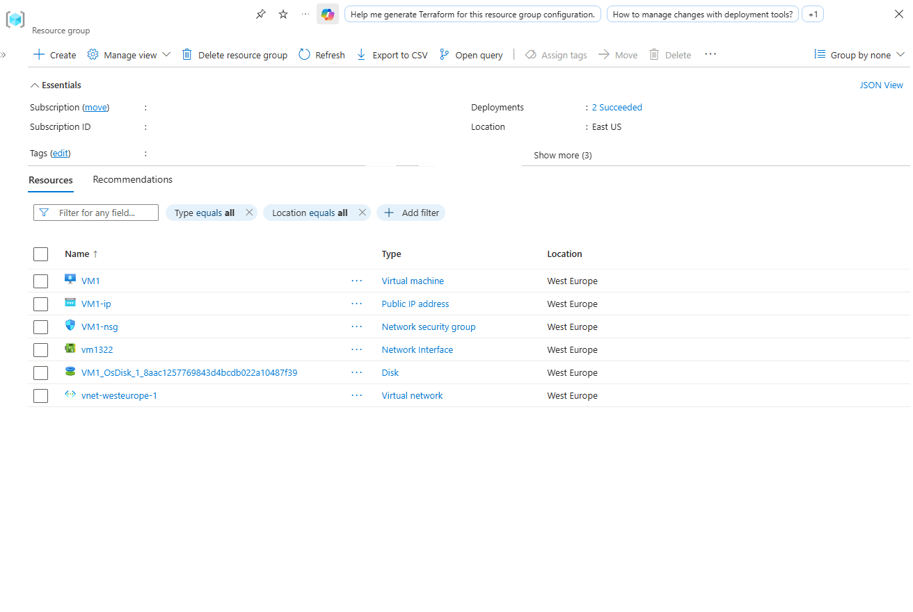
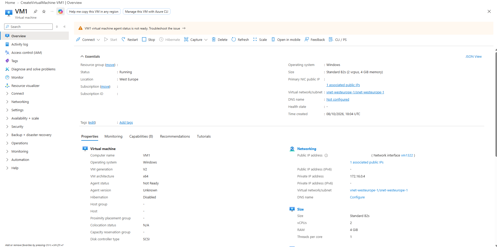
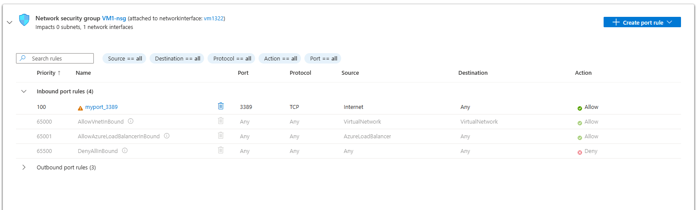
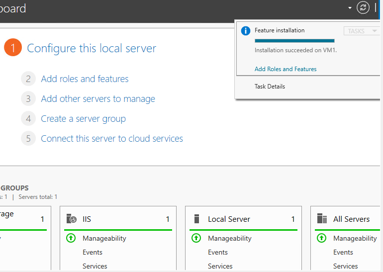
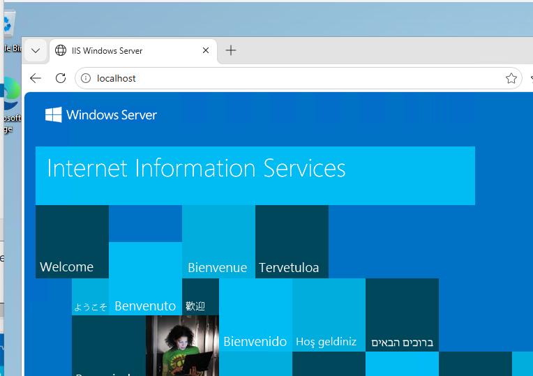

# Azure Network Security Group Inbound Rule Evaluation and Traffic Filtering

Professional documentation detailing the configuration, priority evaluation, and runtime validation of Azure Network Security Group (NSG) inbound security rules protecting a Windows Server virtual machine in the West Europe region. The deployment demonstrates stateful traffic inspection by enabling administrative Remote Desktop (RDP) access, installing Internet Information Services (IIS), and evaluating rule modifications to permit inbound HTTP web traffic.

---

## 1. Architecture & Provisioned Resources

### Core Infrastructure Topology

| Resource | Resource Name | Specification / Sizing | Region |
| :--- | :--- | :--- | :--- |
| **Virtual Machine** | `VM1` | Standard B2s (2 vCPUs, 4 GiB RAM), Windows Server 2025 Datacenter | West Europe |
| **Network Interface** | `vm1322` | Private IP: `172.16.0.4` (Dynamic IPv4) | West Europe |
| **Public IP Address** | `VM1-ip` | Static Standard IPv4 (`20.224.131.17`) | West Europe |
| **Virtual Network** | `vnet-westeurope-1` | Address Space: `172.16.0.0/16` | West Europe |
| **Subnet** | `snet-westeurope-1` | Address Space: `172.16.0.0/24` | West Europe |
| **Network Security Group** | `VM1-nsg` | Attached to `vm1322` Network Interface | West Europe |

---

### Provisioned Environment Validation

*Resource group overview confirming the deployment of VM1, network interface vm1322, virtual network, public IP, and network security group VM1-nsg.*

---

## 2. Step-by-Step Implementation

### Step 1: Inspect Virtual Machine Configuration

Reviewed the compute and networking essentials of `VM1` in the Azure Portal to confirm instance health, Windows Server 2025 operating system version, running status, and public IP allocation.

* **Computer Name:** `VM1`
* **Operating System:** Windows Server 2025 Datacenter Azure Edition
* **Status:** Running
* **Private IPv4 Address:** `172.16.0.4`
* **Primary NIC Public IP:** `20.224.131.17` (`VM1-ip`)

*Reviewing the essentials pane, compute sizing, and networking properties of VM1.*

---

### Step 2: Configure Administrative Inbound RDP Rule

Evaluated the inbound rules on `VM1-nsg` and configured an administrative rule allowing Remote Desktop Protocol traffic over TCP port 3389 from the Internet.

* **Rule Name:** `myport_3389`
* **Priority:** `100`
* **Source:** `Internet`
* **Destination Port:** `3389`
* **Protocol:** `TCP`
* **Action:** `Allow`

*Configured inbound rule permitting TCP port 3389 with high priority.*

---

### Step 3: Install Internet Information Services (IIS) Role

Established a Remote Desktop session to `VM1` via its public IP address (`20.224.131.17:3389`) and utilized Server Manager to install the Web Server (IIS) role components.

* **Target Server:** `VM1`
* **Installed Feature:** Web Server (IIS)
* **Installation Status:** Succeeded

*Server Manager task notification confirming successful installation of the IIS role.*

---

### Step 4: Validate Local IIS Web Server Operation

Opened Microsoft Edge within the remote desktop session on `VM1` and navigated to `http://localhost` to verify local web server initialization prior to exposing the workload externally.

* **URL Tested:** `http://localhost`
* **HTTP Service:** World Wide Web Publishing Service (W3SVC)
* **Response:** Default Windows Server Internet Information Services landing page

*Local validation of the default IIS welcome page on VM1.*

---

### Step 5: Add Inbound HTTP Security Rule

Returned to the Azure Portal to configure an inbound security rule allowing web traffic over TCP port 80, placing it directly below the administrative rule in priority order.
